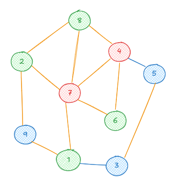
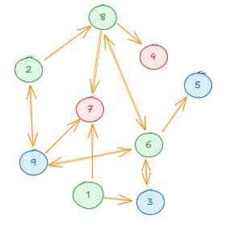
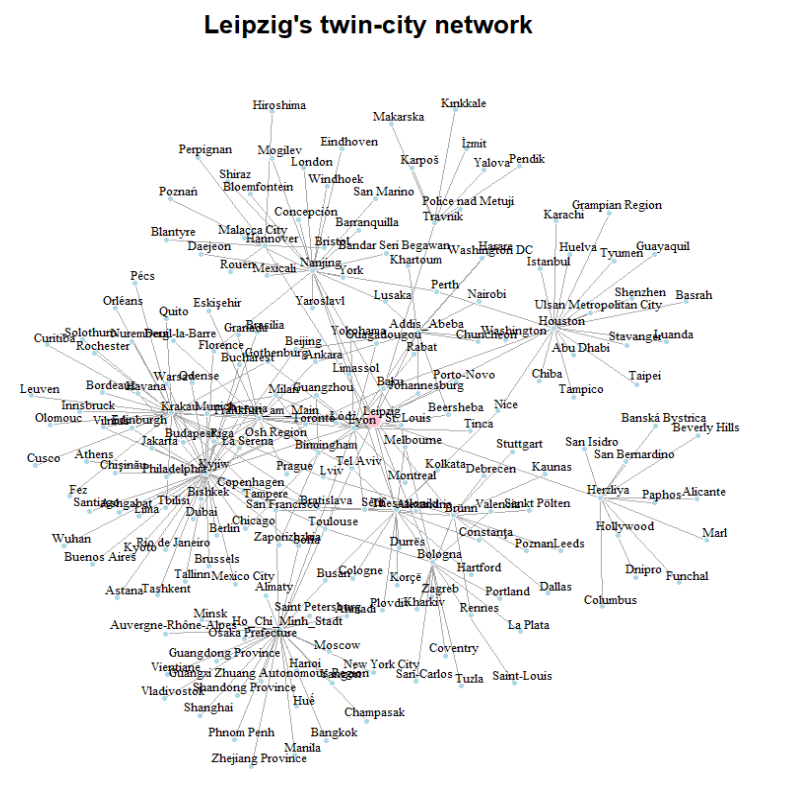

```{r}
#| echo: false

#Environment
library(igraph)
library(stringr)
set.seed(11)
```

**1** In your own words, briefly describe what a social network is and why sociologists are interested in looking at those. **(1 point)**

::: {.callout-note appearance="minimal" style="background-color: lavender; border-left: 5px solid lightblue;"}

A set of acors and the connections between those. Social scientists are interested in those because the placement in a network has different implications for social phenomena, like homophily or social capital.

:::

------------------------------------------------------------------------

**2** Examine the two networks shown below.

::: {#fig-networks layout-ncol=2}

{#fig-undirected width=40%}

{#fig-directed width=40%}

Networkgraphs
:::

**2.1** Formally describe the networks. **(3 points)**

::: {.callout-note appearance="minimal" style="background-color: lavender; border-left: 5px solid lightblue;"}

a): Ein ungerichtetes Netzwerk mit 9 Knoten und 13 Kanten

$Ga = \{Va, Ea\}$

$Va = \{1,2,3,4,5,6,7,8,9\}$

$Ea = \{\{1,3\},\{1,7\},\{1,9\}, \{2,7\},\{2,8\},\{2,9\}, \{3,5\},\{4,5\},\{4,6\}, \{4,7\},\{4,8\},\{6,7\}, \{7,8\}\}$

b): Ein gerichtetes Netzwerk mit 9 Knoten und 15 Kanten

$Gb = \{Vb, Eb\}$

$Vb = \{1,2,3,4,5,6,7,8,9\}$

$Eb = \{(1,3),(1,7),(2,8), (2,9),(3,6),(6,3),(6,5),(6,8),(6,9), (8,4),(8,6),(8,7), (9,2),(9,6),(9,7)\}$


:::


**2.2** Provide one real-world example for each type of network shown in the figures. **(1 point)**

::: {.callout-note appearance="minimal" style="background-color: lavender; border-left: 5px solid lightblue;"}

a) An example is a school network, where edges exist between students that are all members of the same class.
In this type of network, connections indicate shared membership in a group. If a student belongs to a class and another one does too, this relationship is mutual by definition and has no direction. The full network represents all students connected through their shared participation in the same class.

b): An example is a family relationship network, such as parent–child relations.
Here, connections have a clear direction: one person (the parent) is linked to another (the child), but not vice versa. The full network represents a structured system of relationships where direction indicates hierarchy or origin.

:::

**2.3** Based on the directed network (*figure b*), write down the corresponding adjacency matrix. **(3 points)**

::: {.callout-note appearance="minimal" style="background-color: lavender; border-left: 5px solid lightblue;"}

```{r}
M <- matrix(c(0,0,1,0,0,0,1,0,0,
              0,0,0,0,0,0,0,1,1,
              0,0,0,0,0,1,0,0,0,
              0,0,0,0,0,0,0,0,0,
              0,0,0,0,0,0,0,0,0,
              0,0,1,0,1,0,0,1,1,
              0,0,0,0,0,0,0,0,0,
              0,0,0,1,0,1,1,0,0,
              0,1,0,0,0,1,1,0,0
), nrow = 9,
byrow = TRUE)
              

p <- graph_from_adjacency_matrix(
  M,
  mode = "directed"
)

plot(p,
     edge.arrow.size = .2)

ecount(p)

```

:::

------------------------------------------------------------------------
```{r}
#| echo: false 
#| 
twin_cities <- list(
  Addis_Abeba = list(
    cities = c("Ankara", "Harare", "Lyon", "Beersheba", "Johannesburg", "Nairobi", "Beijing", "Khartoum", "Washington", "Chuncheon", "Leipzig", "Washington DC", "Lusaka"),
    countries = c("Turkey", "Zimbabwe", "France", "Israel", "South Africa", "Kenya", "China", "Sudan", "United States", "South Korea", "Germany", "United States", "Zambia")
  ),
  Birmingham = list(
    cities = c("Chicago", "Frankfurt am Main", "Leipzig", "Guangzhou", "Lyon", "Milan", "Johannesburg", "Zaporizhzhia"),
    countries = c("USA", "Germany", "Germany", "China", "France", "Italy", "South Africa", "Ukraine")
  ),
  Bologna = list(
    cities = c("Coventry", "St. Louis", "Kharkiv", "Thessaloniki", "Leipzig", "Toulouse", "La Plata", "Tuzla", "Portland", "Valencia", "Saint-Louis", "San-Carlos", "Zagreb"),
    countries = c("England", "USA", "Ukraine", "Greece", "Germany", "France", "Argentina", "Bosnia and Herzegovina", "United States", "Spain", "Senegal", "Nicaragua", "Croatia")
  ),
  Brünn = list(
    cities = c("Bratislava", "Leipzig", "Dallas", "Lviv", "Debrecen", "Poznan", "Kaunas", "Rennes", "Kharkiv", "Sankt Pölten", "Leeds", "Stuttgart"),
    countries = c("Slovakia", "Germany", "USA", "Ukraine", "Hungary", "Poland", "Lithuania", "France", "Ukraine", "Austria", "England", "Germany")
  ),
  Frankfurt_am_Main = list(
    cities = c("Birmingham", "Budapest", "Deuil-la-Barre", "Dubai", "Eskişehir", "Granada", "Guangzhou", "Kraków", "Leipzig", "Lyon", "Milan", "Philadelphia", "Prague", "Tel Aviv", "Toronto"),
    countries = c("United Kingdom", "Hungary", "France", "United Arab Emirates", "Turkey", "Nicaragua", "China", "Poland", "Germany", "France", "Italy", "United States", "Czech Republic", "Israel", "Canada")
  ),
  Hannover = list(
    cities = c("Blantyre", "Bristol", "Hiroshima", "Leipzig", "Perpignan", "Poznań", "Rouen"),
    countries = c("Malawi", "United Kingdom", "Japan", "Germany", "France", "Poland", "France")
  ),
  Herzliya = list(
    cities = c("Alicante", "Banská Bystrica", "Beverly Hills", "Columbus", "Dnipro", "Funchal", "Hollywood", "Leipzig", "Marl", "Paphos", "San Bernardino", "San Isidro"),
    countries = c("Spain", "Slovakia", "United States", "United States", "Ukraine", "Portugal", "United States", "Germany", "Germany", "Cyprus", "United States", "Argentina")
  ),
  Ho_Chi_Minh_Stadt = list(
    cities = c("Ahmadi", "Almaty", "Auvergne-Rhône-Alpes", "Bangkok", "Champasak", "Busan", "Guangdong Province", "Guangxi Zhuang Autonomous Region", "Hanoi", "Huế", "Leipzig", "Lyon", "Manila", "Minsk", "Moscow", "New York City", "Osaka Prefecture", "Phnom Penh", "Saint Petersburg", "San Francisco", "Shandong Province", "Shanghai", "Sofia", "Vientiane", "Vladivostok", "Yangon", "Zhejiang Province"),
    countries = c("Kuwait", "Kazakhstan", "France", "Thailand", "Laos", "South Korea", "China", "China", "Vietnam", "Vietnam", "Germany", "France", "Philippines", "Belarus", "Russia", "United States", "Japan", "Cambodia", "Russia", "United States", "China", "China", "Bulgaria", "Laos", "Russia", "Myanmar", "China")
  ),
  Houston = list(
    cities = c("Abu Dhabi", "Baku", "Basrah", "Chiba", "Grampian Region", "Guayaquil", "Huelva", "Istanbul", "Karachi", "Leipzig", "Luanda", "Nice", "Perth", "Shenzhen", "Stavanger", "Taipei", "Tampico", "Tyumen", "Ulsan Metropolitan City"),
    countries = c("United Arab Emirates", "Azerbaijan", "Iraq", "Japan", "Scotland", "Ecuador", "Spain", "Turkey", "Pakistan", "Germany", "Angola", "France", "Australia", "China", "Norway", "Taiwan", "Mexico", "Russia", "South Korea")
  ),
  Krakau = list(
    cities = c("Bordeaux", "Bratislava", "Budapest", "Curitiba", "Cusco", "Edinburgh", "Fez", "Frankfurt am Main", "Gothenburg", "Innsbruck", "Kyiv", "Leipzig", "Leuven", "Lviv", "Milan", "Nuremberg", "Olomouc", "Orléans", "Pécs", "Quito", "Rochester", "San Francisco", "La Serena", "Solothurn", "Tbilisi", "Vilnius"),
    countries = c("France", "Slovakia", "Hungary", "Brazil", "Peru", "United Kingdom", "Morocco", "Germany", "Sweden", "Austria", "Ukraine", "Germany", "Belgium", "Ukraine", "Italy", "Germany", "Czech Republic", "France", "Hungary", "Ecuador", "United States", "United States", "Chile", "Switzerland", "Georgia", "Lithuania")
  ),
  Kyjiw = list(
    cities = c("Ankara", "Ashgabat", "Astana", "Athens", "Baku", "Beijing", "Berlin", "Bishkek", "Brasília", "Bratislava", "Brussels", "Bucharest", "Buenos Aires", "Chicago", "Chişinău", "Copenhagen", "Edinburgh", "Florence", "Havana", "Jakarta", "Kraków", "Kyoto", "Leipzig", "Lima", "Mexico City", "Munich", "Odense", "Osh Region", "Pretoria", "Riga", "Rio de Janeiro", "Santiago", "Sofia", "Tallinn", "Tampere", "Tashkent", "Tbilisi", "Toulouse", "Vilnius", "Warsaw", "Wuhan"),
    countries = c("Turkey", "Turkmenistan", "Kazakhstan", "Greece", "Azerbaijan", "China", "Germany", "Kyrgyzstan", "Brazil", "Slovakia", "Belgium", "Romania", "Argentina", "United States", "Moldova", "Denmark", "Scotland", "Italy", "Cuba", "Indonesia", "Poland", "Japan", "Germany", "Peru", "Mexico", "Germany", "Denmark", "Kyrgyzstan", "South Africa", "Latvia", "Brazil", "Chile", "Bulgaria", "Estonia", "Finland", "Uzbekistan", "Georgia", "France", "Lithuania", "Poland", "China")
  ),
  Lyon = list(
    cities = c("Addis Abeba", "Beersheba", "Birmingham", "Frankfurt am Main", "Gothenburg", "Guangzhou", "Ho Chi Minh City", "Leipzig", "Łódź", "Milan", "Montreal", "Ouagadougou", "Porto-Novo", "Rabat", "Sétif", "St. Louis", "Tinca", "Yokohama"),
    countries = c("Ethiopia", "Israel", "United Kingdom", "Germany", "Sweden", "China", "Vietnam", "Germany", "Poland", "Italy", "Canada", "Burkina Faso", "Benin", "Morocco", "Algeria", "United States", "Romania", "Japan")
  ),
  Nanjing = list(
    cities = c("Bandar Seri Begawan", "Barranquilla", "Bloemfontein", "Concepción", "Daejeon", "Eindhoven", "Florence", "Leipzig", "Limassol", "London", "Lusaka", "Malacca City", "Mexicali", "Mogilev", "Perth", "San Marino", "Shiraz", "St. Louis", "Windhoek", "Yaroslavl", "York"),
    countries = c("Brunei", "Colombia", "South Africa", "Chile", "South Korea", "Netherlands", "Italy", "Germany", "Cyprus", "Canada", "Zambia", "Malaysia", "Mexico", "Belarus", "Australia", "San Marino", "Iran", "United States", "Namibia", "Russia", "United Kingdom")
  ),
  Thessaloniki = list(
    cities = c("Alexandria", "Bologna", "Bratislava", "Busan", "Cologne", "Constanţa", "Durrës", "Hartford", "Kolkata", "Korçë", "Leipzig", "Limassol", "Melbourne", "Nice", "Plovdiv", "San Francisco", "Tel Aviv"),
    countries = c("Egypt", "Italy", "Slovakia", "South Korea", "Germany", "Romania", "Albania", "United States", "India", "Albania", "Germany", "Cyprus", "Australia", "France", "Bulgaria", "United States", "Israel")
  ),
  Travnik = list(
    cities = c("İzmit", "Karpoš", "Kırıkkale", "Leipzig", "Makarska", "Pendik", "Police nad Metují", "Yalova"),
    countries = c("Turkey", "North Macedonia", "Turkey", "Germany", "Croatia", "Turkey", "Czech Republic", "Turkey")
  )
)


if (!dir.exists("Data")) dir.create("Data")
saveRDS(twin_cities, file = "Data/twin_cities.rds")


```

**3** A city partnership (also known as a twin city or sister city relationship) is a formal agreement between two cities (most of the time from two different countries) to promote cultural and economic collaboration. The city of Leipzig has 15 such twin cities. On Moodle, you will find an R data file named `twin_cities.rds`, which contains a list of Leipzig's partner cities and their own partner cities. You can load the file into R using the following command:

`twin_cities <- readRDS("your/path/twin_cities.rds")`

**3.1** Using this data, create an igraph object where each node represents a city. Add an edge between two cities if they are partnered and include the country of each city as a vertex attribute. You will need to clean the dataset before creating the graph. In particular, there are minor inconsistencies caused by incorrect handling of whitespace and special characters. Carefully inspect the dataset and fix issues such as extra or missing spaces, inconsistent city name formatting, and incorrectly encoded characters to ensure that identical cities are represented consistently. **(5 points)**

::: {.callout-note appearance="minimal" style="background-color: lavender; border-left: 5px solid lightblue;"}

```{r}

twin_cities <- readRDS("Data/twin_cities.rds")

# Fix spelling differences
name_fixes <- c(
  "Addis Ababa" = "Addis_Abeba",
  "Frankfurt am Main" = "Frankfurt_am_Main",
  "Ho Chi Minh City" = "Ho_Chi_Minh_Stadt",
  "Kyiv" = "Kyjiw",
  "Kraków" = "Krakau"
)

# Apply fixes
names(twin_cities) <- str_replace_all(names(twin_cities),
                                      name_fixes
                                      )

# apply fixes to each twin city entry in the list
for (city in names(twin_cities)) {
  twin_cities[[city]]$cities <- str_replace_all(twin_cities[[city]]$cities,
                                                name_fixes
                                                )
}

#------------------------------------------------

# 1. Create a data frame of edges
edges <- data.frame(from=character(),
                    to=character(),
                    stringsAsFactors = FALSE
                    )

# 2. Create an empty vector for the countries
countries <- vector("list", length = length(twin_cities)
                    )

# 3. Fill the edges and countries list
for (city in names(twin_cities)) {
  for (twin in twin_cities[[city]]$cities) {
    edge <- sort(c(city, twin))  # Sort to avoid duplicate directions
    edges <- rbind(edges,
                   data.frame(from=edge[1],
                              to=edge[2],
                              stringsAsFactors = FALSE
                              )
                   )
  }
}

# 4. Remove duplicate edges
edges <- unique(edges)

#unique(edges$from)

# 5. Create a list of countries for each city using their indices
city_countries <- unlist(lapply(names(twin_cities),
                                function(city)
                                  twin_cities[[city]]$countries
                                )
                         )


# 6. Create the graph
g <- graph_from_data_frame(edges,
                           directed = FALSE)

# 7. Add countries as vertex attributes
V(g)$country <- city_countries[match(V(g)$name,
                                     names(twin_cities)
                                     )
                               ]

vcount(g)
ecount(g)

plot(g, 
     vertex.size = ifelse(V(g)$name == "Leipzig", 5, 2),
     vertex.label.cex = 0.6,
     vertex.label.dist = .5,
     vertex.label.color = "black",
     vertex.label.dist = 1,
     vertex.color = ifelse(V(g)$name == "Leipzig", "pink", "lightblue"),
     vertex.frame.color = "white",
     layout = layout_with_lgl(g),
     main = "Leipzig's twin-city network"
)


```

:::


**3.2** Categorize the form of data collection. **(1 point)**

::: {.callout-note appearance="minimal" style="background-color: lavender; border-left: 5px solid lightblue;"}

The network is a egocentric network (Locally collected). Starting from Leipzig we collected all nodes that have a path $p \leq 2$.

:::

**3.3** Calculate the density of the network. Then explain in one or two sentences what this value tells you about the structure of the network. **(2 points)**

::: {.callout-note appearance="minimal" style="background-color: lavender; border-left: 5px solid lightblue;"}

```{r}
edge_density(g)

```

The density of the network is 0.0116. This means that just over 1 percent of all possible connections (if every city were connected to every other city) are actually realized in the network.

The low density can be attributed to the fact that only a few of the partner cities of Leipzig's partner cities are also connected among themselves.

:::


**3.4** Determine the diameter of the network. What does this diameter represent in the context of the city partnership network? **(1 point)**

::: {.callout-note appearance="minimal" style="background-color: lavender; border-left: 5px solid lightblue;"}

```{r}
diameter(g)
```

The longest distance between two cities in the network is 4. This is due to the way the data was collected—it only includes cities that are at most two steps away from Leipzig (i.e., with a distance of $d = 2$ from Leipzig).
:::

**3.5** Find the shortest path between the cities Budapest and Wuhan. List all cities that lie along this path. **(1 point)**

::: {.callout-note appearance="minimal" style="background-color: lavender; border-left: 5px solid lightblue;"}

```{r}

# Find the shortest path between Hamburg and Tel Aviv
shortest_path <- shortest_paths(g, from = "Budapest", to = "Wuhan", output = "both")

# Print the shortest path
print(shortest_path)

length(shortest_path$vpath[[1]]) - 1


# Extract the vertices in the shortest path
path_vertices <- shortest_path$vpath[[1]]

# Print the cities (vertices) in the shortest path
print(V(g)[path_vertices]$name)
```

The shortest path goes through the cities Krakau and Kyjiw (or possibly through other cities (there can be short paths of the same length via different nodes.)) 

:::

**3.6** Describe the distribution of shortest paths in the network. Then interpret what this distribution tells you about the overall connectivity of the cities. **(2 points)**


::: {.callout-note appearance="minimal" style="background-color: lavender; border-left: 5px solid lightblue;"}

The distribution of the shortest paths in the network is left-skewed and shows that only a few cities are connected to each other through one, two, or three edges. Most cities have a distance of 4.

The distribution of the edges indicates exponential growth in the number of connections: the further one moves away from Leipzig (the "ego"), the more connections there are to other cities, since each newly connected city brings its own network of partner cities into the overall network. At the same time, we can assume that the network reaches a saturation point at some stage—if we were to include all the cities in the world that participate in a sister city program in our dataset.

:::


