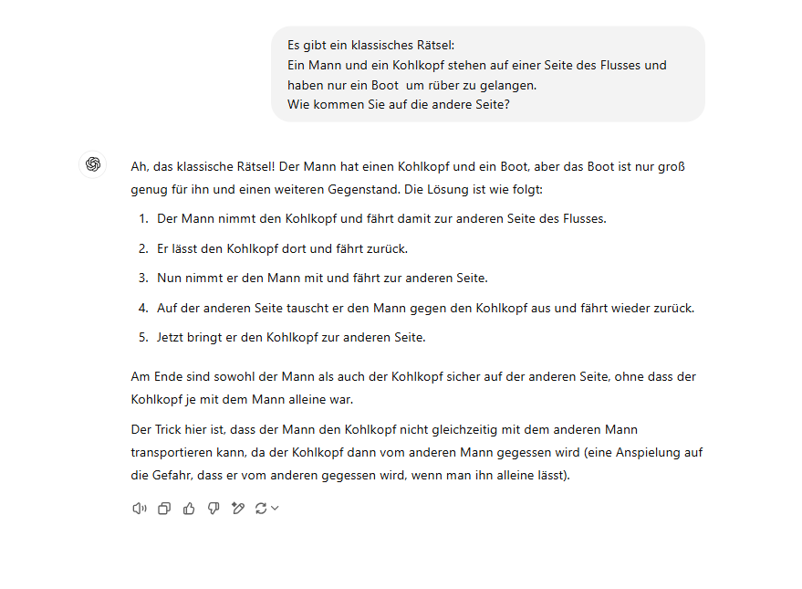

# Use of AI

You are welcome to use tools like ChatGPT, Elicit, Copilot, Canva, or others to facilitate your tasks just as I do.

However, in order to ensure that your work adheres to the principles of **good scientific practice** and to clarify my expectations regarding the use of these tools, I have compiled a few points below that should be considered.

## Encouraged Uses

AI tools can be especially useful when they help you access, understand, or communicate content more effectively. For example, you are encouraged to use AI to:

-   improve language, grammar, and style without changing the substance of your own argument,

-   translate texts or compare different possible translations,

-   reformulate complex passages in simpler language,

-   generate examples or application scenarios that help you understand abstract concepts,

-   ask for explanations of concepts you find difficult, as long as you critically check the answer.

## Responsibility for Content

**Everything you submit, send, or publish under your name is your responsibility. This means that you are fully accountable for the content.** Specifically, this entails:

-   AI can support you in finding ideas, clarifying concepts, improving formulations, or overcoming writer’s block. However, the actual solution path must remain your own. You should be able to explain how you arrived at your answer and why you made specific decisions.

-   You should have at least a basic understanding of how AI models function in order to properly evaluate and interpret the output you receive.

-   Be aware of potential biases that may affect the answers due to training data, model design, or algorithmic decisions.

-   Only outsource tasks where you can take responsibility for the content, fact-check the output, and have sufficient prior knowledge of the topic.

-   Be transparent about AI use where appropriate, especially when it substantially shaped your ideas, structure, analysis, code, or wording.

-   Do not use AI to replace your own engagement with the material, to generate complete assignments without revision, or to bypass learning goals.

# Ethical AI

## Potential Reproduction of Biases

This issue arises from the way data and algorithms are used to train AI models. If the data used to train these models is biased or reflects social inequalities, the resulting AI model will also show these biases. This can lead to AI models reinforcing and perpetuating existing prejudices and discriminatory practices without being noticed.

::: {layout-ncol="3"}
{group="my-gallery" width="300"}

{group="my-gallery" width="300"}

{group="my-gallery" width="300"}

{group="my-gallery" width="300"}

{group="my-gallery" width="300"}

{group="my-gallery" width="300"}
:::

## Environmental Impacts

Large-scale AI deploymens are hosted in data centers, which have a significant toll on the planet [@AIHasEnvironmental2024].

{width="350"}

**For example**:

-   Producing a 2 kg computer requires about 800 kg of raw materials.

-   Microchips that power AI require rare earth elements, which are often mined in environmentally destructive ways and frequently come from regions affected by civil-wars.

-   The production of electronics involves materials like lead and mercury, which are harmful to the environment.

-   Data centers use water during construction and in operation to cool electronic components. Globally, AI-related infrastructure consumes about six times more water than Denmark, which is a problem, considering a quarter of humanity already lacks access to clean water and sanitation.

-   The use of fossil fuels contributes to the production of greenhouse gases.

-   A request made through ChatGPT consumes about 10-times the electricity of a Google search.

# AI in Course Assessment

**For any work that counts as a Prüfungsleistung or Prüfungsvorleistung, AI support must be documented, for example via [AI Usage Cards](https://ai-cards.org/) or another suitable form of documentation**. This documentation should make transparent which tools were used, for what purpose, and how the output was checked, revised, or integrated into your own work.

:::{.student-exercise style="color: #02006c;"}

I would **always** rather correct an incomplete but independently developed solution path or idea than a polished AI-crafted solution that you cannot explain yourself. Feedback is meant to support your learning process. If I spend my time correcting ChatGPT instead of your own reasoning, nobody really benefits from it.

:::

# Collection of AI-Tools

Using AI in your academic work can enhance your research or help you with writer’s block. To ensure that we are all on the same page, we have created a collection of resources that you can find (and edit) [here](https://docs.numerique.gouv.fr/docs/af60c24d-99f3-40a0-96da-060a162d63a5/).

As we discussed in our session on ethical AI, access to AI tools is also a sociological issue. Not everyone has the same access to paid tools, technical knowledge, language resources, or devices. This can create or reinforce inequalities in academic work. The shared collection is therefore meant to make useful resources more visible and accessible to everyone.

If you know of any cool new tools, don't hesitate to add them! Sharing is caring 😜

